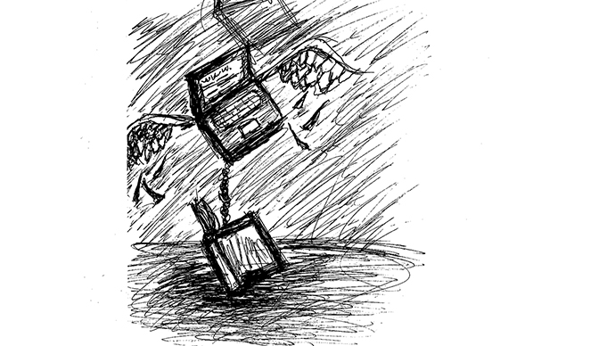

# Ebb-Flow
## Work in progress
- [Summary](#summary)
- [About the Author](#about-the-author)

---

# Summary

The article *A Dao of Web Design* by John Allsopp is a head of its time it addresses the idea of reactive web design in a time when the web was still in its infancy. 
It challenges the philosophy that web pages need to have the same limitations of the printed page. He is calling for the designers of the time to move past that way of thinking and to give web pages their own identity, as well as their own set of rules. He does an excellent job of comparing the problems of early web design to the writings of Tao Te Ching. For example:

> As observing detail is clarity,
So maintaining flexibility is strength;
Use the light but shed no light,
So that you do yourself no harm,
But embrace clarity.

He uses the quote to bring up and discuss the rigidity of the web pages of the time. He furthers this idea by opting for web pages to change with the variables that cannot be controlled by the designer such as screen size and resolution. What can be controlled should be the focus: html and the coding of the page. 

[Read the full article](https://alistapart.com/article/dao)

## About the Author
---

